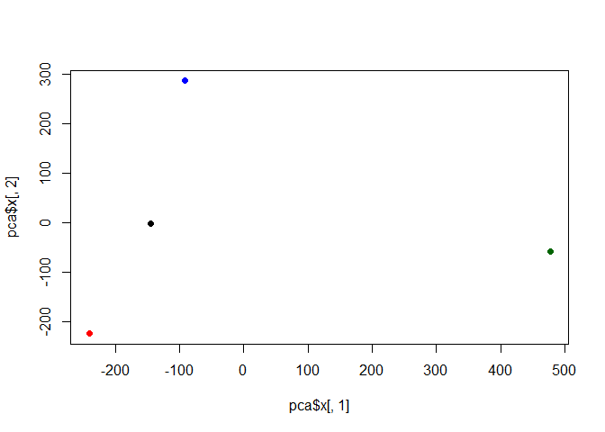

# Class 7: Machine Learning I
Samson A16867000

Today we are going to learn how to apply different machine learning
methods, beiginning with clustering

The goal here is to find groups/clusters in your input data

``` r
rnorm(10)
```

     [1] -2.822594e-01 -3.577182e-01 -1.377749e-07 -8.047126e-02  5.519177e-01
     [6] -4.754626e-01  6.912913e-01 -2.322057e+00 -9.310221e-01 -7.653687e-02

``` r
hist(rnorm(1000, mean =3))
```


``` r
n <- 30
x <- c(rnorm(n,-3), rnorm(n, +3 )) 
y <- rev(x)

z <-cbind(x,y)
head(z)
```

                 x        y
    [1,] -1.807688 2.967272
    [2,] -2.776171 3.274803
    [3,] -4.711832 3.728022
    [4,] -1.752868 1.867786
    [5,] -2.947612 1.748033
    [6,] -5.177884 3.666888

``` r
plot(z)
```


Use the kmeans() function setting k to 2 and nstart=20 Inspect/print the
results

> . Q. How many points are in each cluster? . Q. What ‘component’ of
> your result object details - cluster size? - cluster
> assignment/membership? - cluster center? . Q. Plot x colored by the
> kmeans cluster assignment and add cluster centers as blue points

``` r
km <- kmeans(z, centers = 2)
```

``` r
attributes(km)
```

    $names
    [1] "cluster"      "centers"      "totss"        "withinss"     "tot.withinss"
    [6] "betweenss"    "size"         "iter"         "ifault"      

    $class
    [1] "kmeans"

cluster size

``` r
km$size
```

    [1] 30 30

cluster membership?

``` r
km$cluster
```

     [1] 2 2 2 2 2 2 2 2 2 2 2 2 2 2 2 2 2 2 2 2 2 2 2 2 2 2 2 2 2 2 1 1 1 1 1 1 1 1
    [39] 1 1 1 1 1 1 1 1 1 1 1 1 1 1 1 1 1 1 1 1 1 1

cluster center?

``` r
km$centers
```

              x         y
    1  2.871258 -3.160035
    2 -3.160035  2.871258

``` r
plot(z, col = "red")
```


R will recycle the shorter color vector to be the same length as the
longer (number of data points) in z

``` r
plot(z, col = c("red", "blue"))
```


``` r
plot(z, col = c())
```


``` r
plot(z, col = km$cluster)
```


We can use the `points()` function to add new points to an existing
plot… like th ecluter centers

``` r
rnorm(10)
```

     [1] -2.3389767  0.3076192 -0.7197280  1.5346156  0.9003113  0.7540565
     [7]  0.9166713 -1.4642460  0.3767701  1.2249830

``` r
hist(rnorm(1000, mean =3))
```


``` r
n <- 30
x <- c(rnorm(n,-3), rnorm(n, +3 )) 
y <- rev(x)

z <-cbind(x,y)
head(z)
```

                 x        y
    [1,] -1.523427 2.360094
    [2,] -3.130775 3.711781
    [3,] -2.491384 4.086466
    [4,] -4.722877 1.348254
    [5,] -2.318456 3.327031
    [6,] -4.056544 3.179407

``` r
plot(z)
```


``` r
km <- kmeans(z, centers = 2)
```

``` r
attributes(km)
```

    $names
    [1] "cluster"      "centers"      "totss"        "withinss"     "tot.withinss"
    [6] "betweenss"    "size"         "iter"         "ifault"      

    $class
    [1] "kmeans"

``` r
plot(z, col = "red")
```


R will recycle the shorter color vector to be the same length as the
longer (number of data points) in z

``` r
plot(z, col = c("red", "blue"))
points(km$centers, col = "blue", pch = 15, cex=3)
```


We can use the `points()` function to add new points to an existing
plot… like th ecluter centers

> . Q. Can you run kmeans and ask for 4 clusters please and plot the
> results like we have done above?

``` r
km4 <- kmeans(z, centers = 4)
plot(z, col = km4$cluster)
points(km4$centers, col = "blue", pch = 15, cex=1.5)
```


## Hierarchical Ckustering

Let’s take our same made-up data `z` and see how hclust works.

First we need a distance matrix of our data to be clustered.

``` r
d <- dist(z)
hc <- hclust(d)
hc
```


    Call:
    hclust(d = d)

    Cluster method   : complete 
    Distance         : euclidean 
    Number of objects: 60 

``` r
plot(hc)
abline(h=8, col = "red")
```


I can get my cluster memebership cluster vector by “clutting the tree”
with the `cutree()` function like so:

``` r
grps <- cutree(hc, h=8)
grps
```

     [1] 1 1 1 1 1 1 1 1 1 1 1 1 1 1 1 1 1 1 1 1 1 1 1 1 1 1 1 1 1 1 2 2 2 2 2 2 2 2
    [39] 2 2 2 2 2 2 2 2 2 2 2 2 2 2 2 2 2 2 2 2 2 2

Can you plt `z` again colored by out hcluster results:

``` r
plot(z, col= grps)
```


## PCA of UK food data

Read data from the UK on food consumption in different parts of the UK

``` r
url <- "https://tinyurl.com/UK-foods"
x <- read.csv(url, row.names = 1)
head(x)
```

                   England Wales Scotland N.Ireland
    Cheese             105   103      103        66
    Carcass_meat       245   227      242       267
    Other_meat         685   803      750       586
    Fish               147   160      122        93
    Fats_and_oils      193   235      184       209
    Sugars             156   175      147       139

``` r
barplot(as.matrix(x), beside=T, col=rainbow(nrow(x)))
```


so-called “Pairs” plot can be useful for small datasets like

``` r
pairs(x, col=rainbow(10), pch=16)
```


It’s hard to see structure and trends in even this small dataset how
will we wever do this when we have big datasets with 1,000s or 10s of
thousands of things we are measuring…

## PCA to the rescue

Let’s see how PCA deals with this dataset. So the main function in base
R to do PCA is called `prcomp()`

``` r
pca <- prcomp(t(x))
summary(pca)
```

    Importance of components:
                                PC1      PC2      PC3       PC4
    Standard deviation     324.1502 212.7478 73.87622 3.176e-14
    Proportion of Variance   0.6744   0.2905  0.03503 0.000e+00
    Cumulative Proportion    0.6744   0.9650  1.00000 1.000e+00

Let’s see what is inside this PCA object that we created from running
`prcomp()`

``` r
attributes(pca)
```

    $names
    [1] "sdev"     "rotation" "center"   "scale"    "x"       

    $class
    [1] "prcomp"

``` r
pca$x
```

                     PC1         PC2        PC3           PC4
    England   -144.99315   -2.532999 105.768945 -4.894696e-14
    Wales     -240.52915 -224.646925 -56.475555  5.700024e-13
    Scotland   -91.86934  286.081786 -44.415495 -7.460785e-13
    N.Ireland  477.39164  -58.901862  -4.877895  2.321303e-13

``` r
plot(pca$x[,1],pca$x[,2], 
     col =c("black","red", "blue", "darkgreen"),pch=16,)
```



## Lets focus on PC1 as it accounts for \> 90% of variance

``` r
par(mar=c(10, 3, 0.35, 0))
barplot( pca$rotation[,1], las=2 )
```


