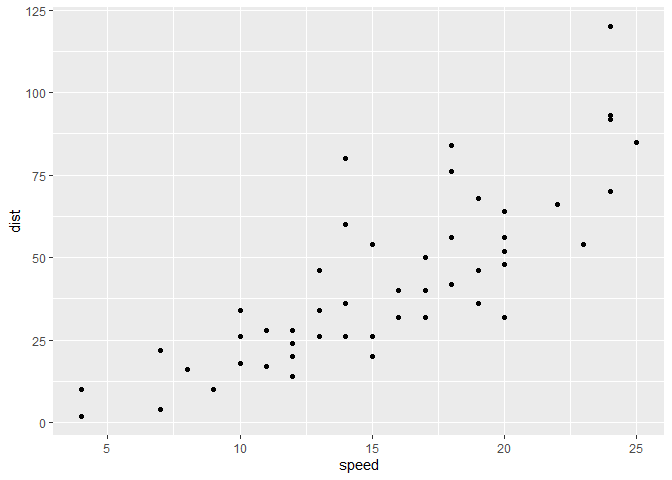
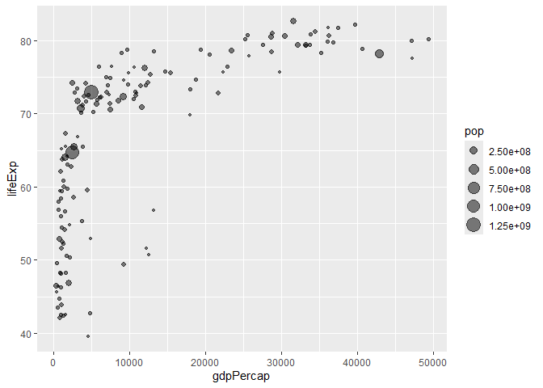

# Class 5: Data vis with ggplot
Samson A16867000

## Plotting in R

R has lot’s of ways to make plots and figures. This includes so-called
**base** grahics and packages like **ggplot2**

``` r
plot(cars)
```


This is a **base** R plot of the in-built `cars` dataset that has only
two columns

``` r
head(cars)
```

      speed dist
    1     4    2
    2     4   10
    3     7    4
    4     7   22
    5     8   16
    6     9   10

> Q.How would we plot this wee dataset with **ggplot**?

All ggplot figures have at least 3 layers:

- **data**
- **aes** (how the data map to the plot)
- **geomes** (how we draw the plot, lines, points, etc.)

Before I use any new package I need to download and install in with the
`install.package()` command.

I never use `install.packages9` within my quarto document otherwise I
will install the package over and over and over again - which is silly!

Once a package is installed I can load it up with the `library()`
function.

``` r
# install.packages("ggplot2")
library(ggplot2)
ggplot(cars) + 
  aes(x=speed, y =dist) +
  geom_point()
```



Key-point: For simple plots (like the one above) ggplot is more verbose
(we need to do more typing) but as plots get more complicated ggplot
starts to be more clear and simple than base R plot()

``` r
ggplot(cars)+
  aes(speed,dist) +
  geom_point() +
  geom_smooth(method = "lm", se=FALSE) +
  labs(title="Stopping distance of old cars",
       subtitle = "from the in-built cars dataset") +
  theme_bw()
```

    `geom_smooth()` using formula = 'y ~ x'


> . Q1. For which phases is data visualization important in our
> scientific workflows?

All of the above

> . Q2. True or False? The ggplot 2 package comes already installed with
> R?

False

> . Q3. Which plot types are typically NOT used to compare distributions
> of numeric variables?

Network graphs

> . Q4. Which statement about data visualization with ggplot2 is
> incorrect?

ggplot2 is the only way to create graphs in R

``` r
url <- "https://bioboot.github.io/bimm143_S20/class-material/up_down_expression.txt"
genes <- read.delim(url)
head(genes)
```

            Gene Condition1 Condition2      State
    1      A4GNT -3.6808610 -3.4401355 unchanging
    2       AAAS  4.5479580  4.3864126 unchanging
    3      AASDH  3.7190695  3.4787276 unchanging
    4       AATF  5.0784720  5.0151916 unchanging
    5       AATK  0.4711421  0.5598642 unchanging
    6 AB015752.4 -3.6808610 -3.5921390 unchanging

> . Q5. Which geometric layer should be used to create scatter plots in
> ggplot2?

geom_point()

> . Q6. Use the nrow() function to find out how many genes are in this
> dataset. What is your answer?

``` r
nrow(genes)
```

    [1] 5196

> .Q7. Use the colnames() function and the ncol() function on the genes
> data frame to find out what the column names are (we will need these
> later) and how many columns there are. How many columns did you find?

``` r
colnames(genes)
```

    [1] "Gene"       "Condition1" "Condition2" "State"     

``` r
ncol(genes)
```

    [1] 4

> .Q8. Use the table() function on the State column of this data.frame
> to find out how many ‘up’ regulated genes there are. What is your
> answer?

``` r
table(genes$State)
```


          down unchanging         up 
            72       4997        127 

> .Q9. Using your values above and 2 significant figures. What fraction
> of total genes is up-regulated in this dataset?

``` r
round( table(genes$State)/nrow(genes) * 100, 2 )
```


          down unchanging         up 
          1.39      96.17       2.44 

> .Q10. Complete the code below to produce the following plot

``` r
ggplot(genes) + 
    aes(x=Condition1, y=Condition2) +
    geom_point()
```


``` r
p <- ggplot(genes) + 
    aes(x=Condition1, y=Condition2, col=State) +
    geom_point()
p
```


``` r
p + scale_colour_manual( values=c("blue","gray","red") )
```


> . Q11. Nice, now add some plot annotations to the p object with the
> labs() function so your plot looks like the following:

``` r
p + scale_colour_manual(values=c("blue","gray","red")) +
    labs(title="Gene Expresion Changes Upon Drug Treatment",
         x="Control (no drug) ",
         y="Drug Treatment")
```


``` r
# File location online
url <- "https://raw.githubusercontent.com/jennybc/gapminder/master/inst/extdata/gapminder.tsv"

gapminder <- read.delim(url)
```

``` r
# install.packages("dplyr")  ## un-comment to install if needed
library(dplyr)
```


    Attaching package: 'dplyr'

    The following objects are masked from 'package:stats':

        filter, lag

    The following objects are masked from 'package:base':

        intersect, setdiff, setequal, union

``` r
gapminder_2007 <- gapminder %>% filter(year==2007)
```

> . Q. Complete the code below to produce a first basic scater plot of
> this gapminder_2007 dataset

``` r
ggplot(gapminder_2007) +
  aes(x=gdpPercap, y=lifeExp) +
  geom_point()
```


``` r
ggplot(gapminder_2007) +
  aes(x=gdpPercap, y=lifeExp) +
  geom_point(alpha=0.5)
```


``` r
ggplot(gapminder_2007) +
  aes(x=gdpPercap, y=lifeExp, color=continent, size=pop) +
  geom_point(alpha=0.5)
```


``` r
ggplot(gapminder_2007) + 
  aes(x = gdpPercap, y = lifeExp, color = pop) +
  geom_point(alpha=0.8)
```


``` r
ggplot(gapminder_2007) + 
  aes(x = gdpPercap, y = lifeExp, size = pop) +
  geom_point(alpha=0.5)
```



``` r
ggplot(gapminder_2007) + 
  geom_point(aes(x = gdpPercap, y = lifeExp,
                 size = pop), alpha=0.5) + 
  scale_size_area(max_size = 10)
```


> . Q. Can you adapt the code you have learned thus far to reproduce our
> gapminder scatter plot for the year 1957? What do you notice about
> this plot is it easy to compare with the one for 2007?

``` r
gapminder_1957 <- gapminder %>% filter(year==1957)

ggplot(gapminder_1957) + 
  aes(x = gdpPercap, y = lifeExp, color=continent,
                 size = pop) +
  geom_point(alpha=0.7) + 
  scale_size_area(max_size = 10) 
```


> . Q. Do the same steps above but include 1957 and 2007 in your input
> dataset for ggplot(). You should now include the layer
> facet_wrap(~year) to produce the following plot:

``` r
gapminder_1957 <- gapminder %>% filter(year==1957 | year==2007)

ggplot(gapminder_1957) + 
  geom_point(aes(x = gdpPercap, y = lifeExp, color=continent,
                 size = pop), alpha=0.7) + 
  scale_size_area(max_size = 10) +
  facet_wrap(~year)
```


