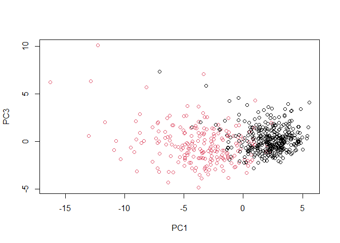
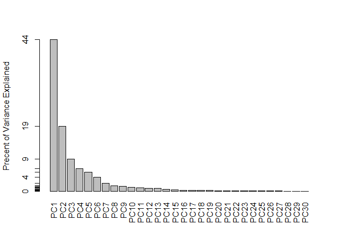
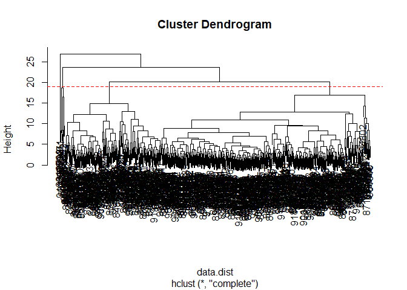
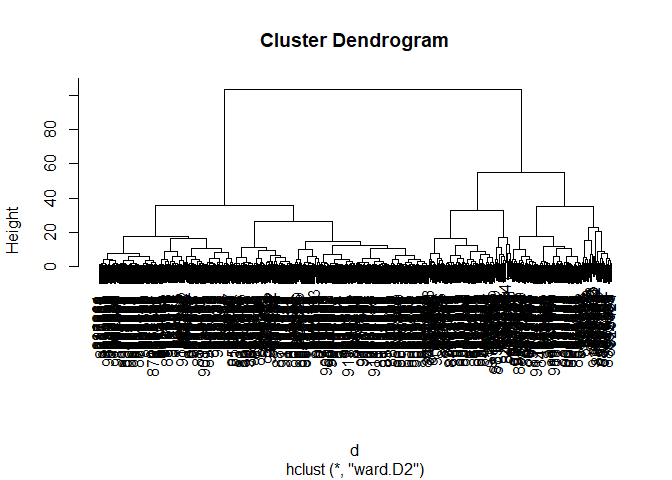

# Class 8:PCA Mini Project
Samson A16867000

For example:

``` r
head(mtcars)
```

                       mpg cyl disp  hp drat    wt  qsec vs am gear carb
    Mazda RX4         21.0   6  160 110 3.90 2.620 16.46  0  1    4    4
    Mazda RX4 Wag     21.0   6  160 110 3.90 2.875 17.02  0  1    4    4
    Datsun 710        22.8   4  108  93 3.85 2.320 18.61  1  1    4    1
    Hornet 4 Drive    21.4   6  258 110 3.08 3.215 19.44  1  0    3    1
    Hornet Sportabout 18.7   8  360 175 3.15 3.440 17.02  0  0    3    2
    Valiant           18.1   6  225 105 2.76 3.460 20.22  1  0    3    1

``` r
colMeans(mtcars)
```

           mpg        cyl       disp         hp       drat         wt       qsec 
     20.090625   6.187500 230.721875 146.687500   3.596563   3.217250  17.848750 
            vs         am       gear       carb 
      0.437500   0.406250   3.687500   2.812500 

``` r
apply(mtcars, 2, sd)
```

            mpg         cyl        disp          hp        drat          wt 
      6.0269481   1.7859216 123.9386938  68.5628685   0.5346787   0.9784574 
           qsec          vs          am        gear        carb 
      1.7869432   0.5040161   0.4989909   0.7378041   1.6152000 

``` r
x <- scale(mtcars)
head(x)
```

                             mpg        cyl        disp         hp       drat
    Mazda RX4          0.1508848 -0.1049878 -0.57061982 -0.5350928  0.5675137
    Mazda RX4 Wag      0.1508848 -0.1049878 -0.57061982 -0.5350928  0.5675137
    Datsun 710         0.4495434 -1.2248578 -0.99018209 -0.7830405  0.4739996
    Hornet 4 Drive     0.2172534 -0.1049878  0.22009369 -0.5350928 -0.9661175
    Hornet Sportabout -0.2307345  1.0148821  1.04308123  0.4129422 -0.8351978
    Valiant           -0.3302874 -0.1049878 -0.04616698 -0.6080186 -1.5646078
                                wt       qsec         vs         am       gear
    Mazda RX4         -0.610399567 -0.7771651 -0.8680278  1.1899014  0.4235542
    Mazda RX4 Wag     -0.349785269 -0.4637808 -0.8680278  1.1899014  0.4235542
    Datsun 710        -0.917004624  0.4260068  1.1160357  1.1899014  0.4235542
    Hornet 4 Drive    -0.002299538  0.8904872  1.1160357 -0.8141431 -0.9318192
    Hornet Sportabout  0.227654255 -0.4637808 -0.8680278 -0.8141431 -0.9318192
    Valiant            0.248094592  1.3269868  1.1160357 -0.8141431 -0.9318192
                            carb
    Mazda RX4          0.7352031
    Mazda RX4 Wag      0.7352031
    Datsun 710        -1.1221521
    Hornet 4 Drive    -1.1221521
    Hornet Sportabout -0.5030337
    Valiant           -1.1221521

``` r
round(colMeans(x), 2)
```

     mpg  cyl disp   hp drat   wt qsec   vs   am gear carb 
       0    0    0    0    0    0    0    0    0    0    0 

Key point: It is usually always a good idea to scale your data before to
PCA…

\##Breast Cancer Biopsy Analysis

# Save your input data file into your Project directory

``` r
fna.data <- "WisconsinCancer.csv"
```

# Complete the following code to input the data and store as wisc.df

``` r
wisc.df <- read.csv(fna.data, row.names=1)
```

``` r
View(wisc.df)
```

``` r
?head
```

    starting httpd help server ... done

\#Create a diagnosis vector for later

``` r
diagnosis <- wisc.df[,1]
table(diagnosis)
```

    diagnosis
      B   M 
    357 212 

Remove this first `diagnosis` column from the dataset as I don’t want to
pass this to PCA etc. It is essentially the expert “answer” that we will
compare our analysis results to.

``` r
# We can use -1 here to remove the first columnn
wisc.data <- wisc.df[,-1]
head(wisc.data)
```

             radius_mean texture_mean perimeter_mean area_mean smoothness_mean
    842302         17.99        10.38         122.80    1001.0         0.11840
    842517         20.57        17.77         132.90    1326.0         0.08474
    84300903       19.69        21.25         130.00    1203.0         0.10960
    84348301       11.42        20.38          77.58     386.1         0.14250
    84358402       20.29        14.34         135.10    1297.0         0.10030
    843786         12.45        15.70          82.57     477.1         0.12780
             compactness_mean concavity_mean concave.points_mean symmetry_mean
    842302            0.27760         0.3001             0.14710        0.2419
    842517            0.07864         0.0869             0.07017        0.1812
    84300903          0.15990         0.1974             0.12790        0.2069
    84348301          0.28390         0.2414             0.10520        0.2597
    84358402          0.13280         0.1980             0.10430        0.1809
    843786            0.17000         0.1578             0.08089        0.2087
             fractal_dimension_mean radius_se texture_se perimeter_se area_se
    842302                  0.07871    1.0950     0.9053        8.589  153.40
    842517                  0.05667    0.5435     0.7339        3.398   74.08
    84300903                0.05999    0.7456     0.7869        4.585   94.03
    84348301                0.09744    0.4956     1.1560        3.445   27.23
    84358402                0.05883    0.7572     0.7813        5.438   94.44
    843786                  0.07613    0.3345     0.8902        2.217   27.19
             smoothness_se compactness_se concavity_se concave.points_se
    842302        0.006399        0.04904      0.05373           0.01587
    842517        0.005225        0.01308      0.01860           0.01340
    84300903      0.006150        0.04006      0.03832           0.02058
    84348301      0.009110        0.07458      0.05661           0.01867
    84358402      0.011490        0.02461      0.05688           0.01885
    843786        0.007510        0.03345      0.03672           0.01137
             symmetry_se fractal_dimension_se radius_worst texture_worst
    842302       0.03003             0.006193        25.38         17.33
    842517       0.01389             0.003532        24.99         23.41
    84300903     0.02250             0.004571        23.57         25.53
    84348301     0.05963             0.009208        14.91         26.50
    84358402     0.01756             0.005115        22.54         16.67
    843786       0.02165             0.005082        15.47         23.75
             perimeter_worst area_worst smoothness_worst compactness_worst
    842302            184.60     2019.0           0.1622            0.6656
    842517            158.80     1956.0           0.1238            0.1866
    84300903          152.50     1709.0           0.1444            0.4245
    84348301           98.87      567.7           0.2098            0.8663
    84358402          152.20     1575.0           0.1374            0.2050
    843786            103.40      741.6           0.1791            0.5249
             concavity_worst concave.points_worst symmetry_worst
    842302            0.7119               0.2654         0.4601
    842517            0.2416               0.1860         0.2750
    84300903          0.4504               0.2430         0.3613
    84348301          0.6869               0.2575         0.6638
    84358402          0.4000               0.1625         0.2364
    843786            0.5355               0.1741         0.3985
             fractal_dimension_worst
    842302                   0.11890
    842517                   0.08902
    84300903                 0.08758
    84348301                 0.17300
    84358402                 0.07678
    843786                   0.12440

## Exploratory Data Analysis

> . Q1. How many observations are in this dataset?

``` r
nrow(wisc.data)
```

    [1] 569

569 observations in this dataset

> . Q2. How many of the observations have a malignant diagnosis?

``` r
table(diagnosis)["M"]
```

      M 
    212 

212 observations have a malignant diagnosis

> . Q3. How many variables/features in the data are suffixed with
> \_mean?

``` r
colnames(wisc.data)
```

     [1] "radius_mean"             "texture_mean"           
     [3] "perimeter_mean"          "area_mean"              
     [5] "smoothness_mean"         "compactness_mean"       
     [7] "concavity_mean"          "concave.points_mean"    
     [9] "symmetry_mean"           "fractal_dimension_mean" 
    [11] "radius_se"               "texture_se"             
    [13] "perimeter_se"            "area_se"                
    [15] "smoothness_se"           "compactness_se"         
    [17] "concavity_se"            "concave.points_se"      
    [19] "symmetry_se"             "fractal_dimension_se"   
    [21] "radius_worst"            "texture_worst"          
    [23] "perimeter_worst"         "area_worst"             
    [25] "smoothness_worst"        "compactness_worst"      
    [27] "concavity_worst"         "concave.points_worst"   
    [29] "symmetry_worst"          "fractal_dimension_worst"

``` r
grep("_mean",colnames(wisc.data))
```

     [1]  1  2  3  4  5  6  7  8  9 10

``` r
length(grep("_mean",colnames(wisc.data)))
```

    [1] 10

10 varaibles are suffixed with \_mean

## Principle Component Analysis

``` r
# Check column means and standard deviations
colMeans(wisc.data)
```

                radius_mean            texture_mean          perimeter_mean 
               1.412729e+01            1.928965e+01            9.196903e+01 
                  area_mean         smoothness_mean        compactness_mean 
               6.548891e+02            9.636028e-02            1.043410e-01 
             concavity_mean     concave.points_mean           symmetry_mean 
               8.879932e-02            4.891915e-02            1.811619e-01 
     fractal_dimension_mean               radius_se              texture_se 
               6.279761e-02            4.051721e-01            1.216853e+00 
               perimeter_se                 area_se           smoothness_se 
               2.866059e+00            4.033708e+01            7.040979e-03 
             compactness_se            concavity_se       concave.points_se 
               2.547814e-02            3.189372e-02            1.179614e-02 
                symmetry_se    fractal_dimension_se            radius_worst 
               2.054230e-02            3.794904e-03            1.626919e+01 
              texture_worst         perimeter_worst              area_worst 
               2.567722e+01            1.072612e+02            8.805831e+02 
           smoothness_worst       compactness_worst         concavity_worst 
               1.323686e-01            2.542650e-01            2.721885e-01 
       concave.points_worst          symmetry_worst fractal_dimension_worst 
               1.146062e-01            2.900756e-01            8.394582e-02 

``` r
apply(wisc.data,2,sd)
```

                radius_mean            texture_mean          perimeter_mean 
               3.524049e+00            4.301036e+00            2.429898e+01 
                  area_mean         smoothness_mean        compactness_mean 
               3.519141e+02            1.406413e-02            5.281276e-02 
             concavity_mean     concave.points_mean           symmetry_mean 
               7.971981e-02            3.880284e-02            2.741428e-02 
     fractal_dimension_mean               radius_se              texture_se 
               7.060363e-03            2.773127e-01            5.516484e-01 
               perimeter_se                 area_se           smoothness_se 
               2.021855e+00            4.549101e+01            3.002518e-03 
             compactness_se            concavity_se       concave.points_se 
               1.790818e-02            3.018606e-02            6.170285e-03 
                symmetry_se    fractal_dimension_se            radius_worst 
               8.266372e-03            2.646071e-03            4.833242e+00 
              texture_worst         perimeter_worst              area_worst 
               6.146258e+00            3.360254e+01            5.693570e+02 
           smoothness_worst       compactness_worst         concavity_worst 
               2.283243e-02            1.573365e-01            2.086243e-01 
       concave.points_worst          symmetry_worst fractal_dimension_worst 
               6.573234e-02            6.186747e-02            1.806127e-02 

``` r
# Perform PCA on wisc.data by completing the following code
wisc.pr <- prcomp(wisc.data, scale = T)
summary(wisc.pr)
```

    Importance of components:
                              PC1    PC2     PC3     PC4     PC5     PC6     PC7
    Standard deviation     3.6444 2.3857 1.67867 1.40735 1.28403 1.09880 0.82172
    Proportion of Variance 0.4427 0.1897 0.09393 0.06602 0.05496 0.04025 0.02251
    Cumulative Proportion  0.4427 0.6324 0.72636 0.79239 0.84734 0.88759 0.91010
                               PC8    PC9    PC10   PC11    PC12    PC13    PC14
    Standard deviation     0.69037 0.6457 0.59219 0.5421 0.51104 0.49128 0.39624
    Proportion of Variance 0.01589 0.0139 0.01169 0.0098 0.00871 0.00805 0.00523
    Cumulative Proportion  0.92598 0.9399 0.95157 0.9614 0.97007 0.97812 0.98335
                              PC15    PC16    PC17    PC18    PC19    PC20   PC21
    Standard deviation     0.30681 0.28260 0.24372 0.22939 0.22244 0.17652 0.1731
    Proportion of Variance 0.00314 0.00266 0.00198 0.00175 0.00165 0.00104 0.0010
    Cumulative Proportion  0.98649 0.98915 0.99113 0.99288 0.99453 0.99557 0.9966
                              PC22    PC23   PC24    PC25    PC26    PC27    PC28
    Standard deviation     0.16565 0.15602 0.1344 0.12442 0.09043 0.08307 0.03987
    Proportion of Variance 0.00091 0.00081 0.0006 0.00052 0.00027 0.00023 0.00005
    Cumulative Proportion  0.99749 0.99830 0.9989 0.99942 0.99969 0.99992 0.99997
                              PC29    PC30
    Standard deviation     0.02736 0.01153
    Proportion of Variance 0.00002 0.00000
    Cumulative Proportion  1.00000 1.00000

> . Q4. From your results, what proportion of the original variance is
> captured by the first principal components (PC1)?

Proportion of Variance by PC1 = 0.44

> . Q5. How many principal components (PCs) are required to describe at
> least 70% of the original variance in the data?

3PCs since it’d cumulative proportion is 0.72636

> . Q6. How many principal components (PCs) are required to describe at
> least 90% of the original variance in the data?

7PCs since it’d cumulative proportion is 0.91010

Main “PC score plot,” “PC1’ vs PC2 plot”

``` r
head(wisc.pr$x)
```

                   PC1        PC2        PC3       PC4        PC5         PC6
    842302   -9.184755  -1.946870 -1.1221788 3.6305364  1.1940595  1.41018364
    842517   -2.385703   3.764859 -0.5288274 1.1172808 -0.6212284  0.02863116
    84300903 -5.728855   1.074229 -0.5512625 0.9112808  0.1769302  0.54097615
    84348301 -7.116691 -10.266556 -3.2299475 0.1524129  2.9582754  3.05073750
    84358402 -3.931842   1.946359  1.3885450 2.9380542 -0.5462667 -1.22541641
    843786   -2.378155  -3.946456 -2.9322967 0.9402096  1.0551135 -0.45064213
                     PC7         PC8         PC9       PC10       PC11       PC12
    842302    2.15747152  0.39805698 -0.15698023 -0.8766305 -0.2627243 -0.8582593
    842517    0.01334635 -0.24077660 -0.71127897  1.1060218 -0.8124048  0.1577838
    84300903 -0.66757908 -0.09728813  0.02404449  0.4538760  0.6050715  0.1242777
    84348301  1.42865363 -1.05863376 -1.40420412 -1.1159933  1.1505012  1.0104267
    84358402 -0.93538950 -0.63581661 -0.26357355  0.3773724 -0.6507870 -0.1104183
    843786    0.49001396  0.16529843 -0.13335576 -0.5299649 -0.1096698  0.0813699
                    PC13         PC14         PC15        PC16        PC17
    842302    0.10329677 -0.690196797  0.601264078  0.74446075 -0.26523740
    842517   -0.94269981 -0.652900844 -0.008966977 -0.64823831 -0.01719707
    84300903 -0.41026561  0.016665095 -0.482994760  0.32482472  0.19075064
    84348301 -0.93245070 -0.486988399  0.168699395  0.05132509  0.48220960
    84358402  0.38760691 -0.538706543 -0.310046684 -0.15247165  0.13302526
    843786   -0.02625135  0.003133944 -0.178447576 -0.01270566  0.19671335
                    PC18       PC19        PC20         PC21        PC22
    842302   -0.54907956  0.1336499  0.34526111  0.096430045 -0.06878939
    842517    0.31801756 -0.2473470 -0.11403274 -0.077259494  0.09449530
    84300903 -0.08789759 -0.3922812 -0.20435242  0.310793246  0.06025601
    84348301 -0.03584323 -0.0267241 -0.46432511  0.433811661  0.20308706
    84358402 -0.01869779  0.4610302  0.06543782 -0.116442469  0.01763433
    843786   -0.29727706 -0.1297265 -0.07117453 -0.002400178  0.10108043
                    PC23         PC24         PC25         PC26        PC27
    842302    0.08444429  0.175102213  0.150887294 -0.201326305 -0.25236294
    842517   -0.21752666 -0.011280193  0.170360355 -0.041092627  0.18111081
    84300903 -0.07422581 -0.102671419 -0.171007656  0.004731249  0.04952586
    84348301 -0.12399554 -0.153294780 -0.077427574 -0.274982822  0.18330078
    84358402  0.13933105  0.005327110 -0.003059371  0.039219780  0.03213957
    843786    0.03344819 -0.002837749 -0.122282765 -0.030272333 -0.08438081
                      PC28         PC29          PC30
    842302   -0.0338846387  0.045607590  0.0471277407
    842517    0.0325955021 -0.005682424  0.0018662342
    84300903  0.0469844833  0.003143131 -0.0007498749
    84348301  0.0424469831 -0.069233868  0.0199198881
    84358402 -0.0347556386  0.005033481 -0.0211951203
    843786    0.0007296587 -0.019703996 -0.0034564331

> . Q7. What stands out to you about this plot? Is it easy or difficult
> to understand? Why?

``` r
biplot(wisc.pr)
```


What stands out about this plot is that it is that the row names and
column names are in the plot which make it very difficult to see.

``` r
plot(wisc.pr$x[,1], wisc.pr$x[,2],
     col = as.factor(diagnosis),xlab = "PC1", ylab = "PC2")
```


> . Q8. Generate a similar plot for principal components 1 and 3. What
> do you notice about these plots?

``` r
plot(wisc.pr$x[,1], wisc.pr$x[,3],
     col = as.factor(diagnosis),xlab = "PC1", ylab = "PC3")
```



I notice that the first plot with PC1 and PC2 has a more distinct
separation between the two groups compared to the plot with PC1 and PC3

``` r
# Create a data.frame for ggplot
df <- as.data.frame(wisc.pr$x)
df$diagnosis <- diagnosis

# Load the ggplot2 package
library(ggplot2)

# Make a scatter plot colored by diagnosis
ggplot(df) + 
  aes(PC1, PC2, col= diagnosis) + 
  geom_point()
```


``` r
# Calculate variance of each component
pr.var <- wisc.pr$sdev^2
head(pr.var)
```

    [1] 13.281608  5.691355  2.817949  1.980640  1.648731  1.207357

``` r
# Variance explained by each principal component: pve
pve <- pr.var / sum(pr.var)

# Plot variance explained for each principal component
plot(pve, xlab = "Principal Component", 
     ylab = "Proportion of Variance Explained", 
     ylim = c(0, 1), type = "o")
```


``` r
# Alternative scree plot of the same data, note data driven y-axis
barplot(pve, ylab = "Precent of Variance Explained",
     names.arg=paste0("PC",1:length(pve)), las=2, axes = FALSE)
axis(2, at=pve, labels=round(pve,2)*100 )
```



> . Q9. For the first principal component, what is the component of the
> loading vector (i.e. wisc.pr\$rotation\[,1\]) for the feature
> concave.points_mean?

``` r
loading_vector <- wisc.pr$rotation[,1]  
component <- loading_vector["concave.points_mean"]
component
```

    concave.points_mean 
             -0.2608538 

> . Q10. What is the minimum number of principal components required to
> explain 80% of the variance of the data?

5

## Hierarchical Clustering

``` r
# Scale the wisc.data data using the "scale()" function
data.scaled <- scale(wisc.data)
```

``` r
data.dist <- dist(data.scaled)
```

``` r
wisc.hclust <- hclust(data.dist, method = "complete")
```

> . Q11. Using the plot() and abline() functions, what is the height at
> which the clustering model has 4 clusters?

``` r
plot(wisc.hclust)
abline(h= 19, col="red", lty=2)
```



The clustering model has 4 clusters at height 19

``` r
wisc.hclust.clusters <- cutree(wisc.hclust, k = 4)
```

``` r
table(wisc.hclust.clusters, diagnosis)
```

                        diagnosis
    wisc.hclust.clusters   B   M
                       1  12 165
                       2   2   5
                       3 343  40
                       4   0   2

> . Q12. Can you find a better cluster vs diagnoses match by cutting
> into a different number of clusters between 2 and 10?

There were not any better cluster vs diagnosis matches from cutting into
a different number of clusters between 2 and 10

``` r
wisc.hclust.clusters <- cutree(wisc.hclust, k = 2)
```

``` r
table(wisc.hclust.clusters, diagnosis)
```

                        diagnosis
    wisc.hclust.clusters   B   M
                       1 357 210
                       2   0   2

> . Q13. Which method gives your favorite results for the same data.dist
> dataset? Explain your reasoning.

I like using “complete” because it is more visually appealing in terms
of looking at the crossbars of clusters compared to something we may see
from using “single”.

``` r
d <- dist(wisc.pr$x[,1:3])
hc <- hclust(d, method = "ward.D2")
plot(hc )
```


